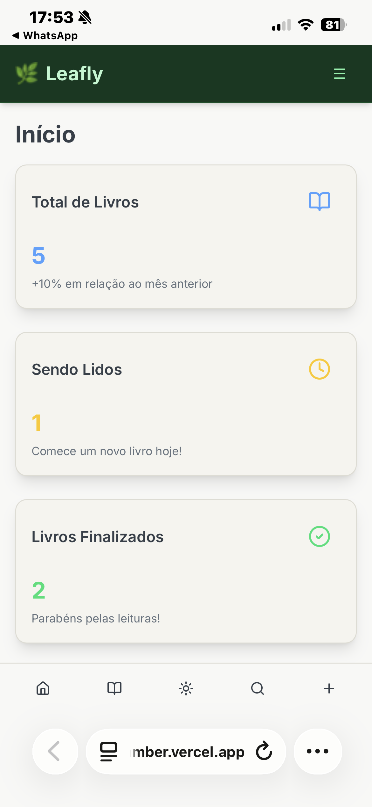
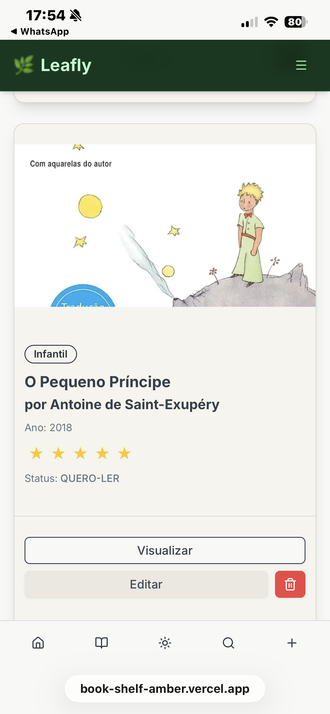
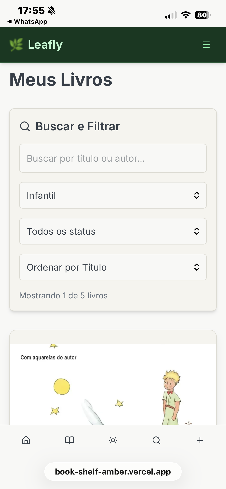
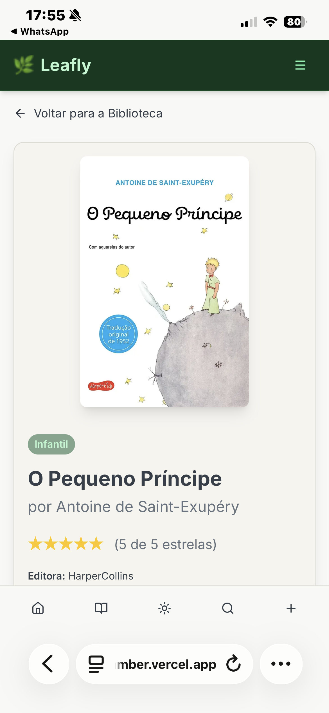
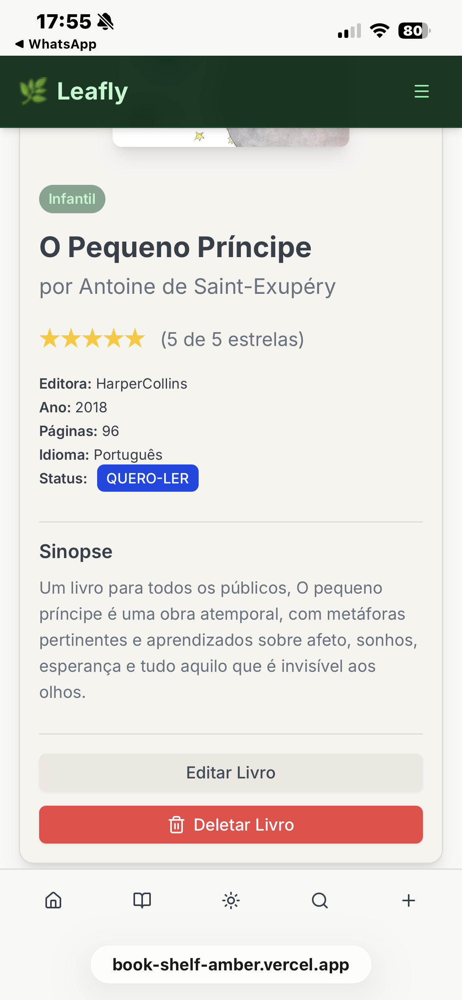
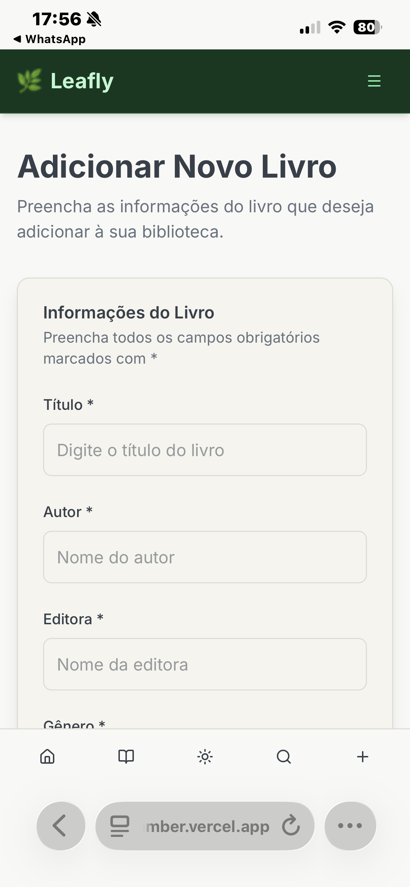
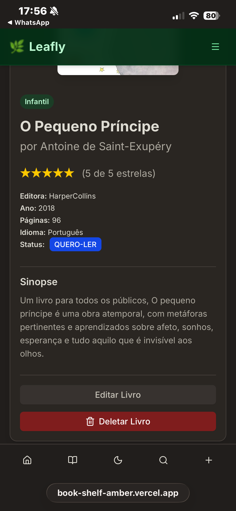

<p align="center">
   
</p>

<h1 align="center">Leafly 🌿</h1>
<p align="center"><b>Sua Biblioteca Digital Completa</b></p>


<p align="center">
   
   
   
   
   
</p>

---

[](https://github.com/Junior-Hugos/Projeto-Site/blob/main/LICENSE)


# Leafly 🌿 – Sua Biblioteca Digital Completa

O **Leafly** é uma aplicação web moderna e completa para **organizar, catalogar e gerenciar sua biblioteca pessoal**. Com funcionalidades CRUD completas, sistema de filtros avançados, Server Actions do Next.js 15 e uma interface responsiva, é a solução ideal para leitores que querem uma experiência digital profissional.

---

## ✨ Principais Recursos

- 📊 **Dashboard completo** com estatísticas dinâmicas em tempo real
- 📚 **CRUD completo** - Criar, Ler, Atualizar e Deletar livros
- 🔍 **Filtros avançados** com busca, gênero, status e ordenação
- 🌙 **Dark Mode completo** com 3 modos e persistência
- 📱 **Design responsivo** mobile-first
- 🚀 **Server Actions** do Next.js 15 para performance otimizada
- 🗂️ **Persistência de dados** com sistema de arquivos JSON
- ♿ **Acessibilidade** WCAG compliant

---

## 🚀 Tecnologias Utilizadas

- [Next.js 15](https://nextjs.org/) (App Router + Server Actions + Turbopack)
- [React 19](https://react.dev/) (Server Components + Client Components)
- [TypeScript](https://www.typescriptlang.org/) (Tipagem completa com strict mode)
- [Tailwind CSS 4](https://tailwindcss.com/) (Styling moderno e responsivo)
- [Lucide React](https://lucide.dev/) (Ícones consistentes)
- **Server Actions** do Next.js 15 para formulários otimizados
- **API Routes** personalizadas para CRUD completo
- **File System Storage** para persistência de dados

---

## ⚙️ Funcionalidades Implementadas

### 📊 Dashboard Dinâmico ✅ COMPLETO

- **Estatísticas em tempo real**:
  - 📚 Total de livros cadastrados
  - ⏱️ Livros sendo lidos
  - ✅ Livros finalizados
  - 📖 Total de páginas lidas
- 🎨 **Cards visuais** com ícones e animações
- � **Atualização automática** quando dados mudam
- 📱 **Layout responsivo** otimizado

### 📚 Biblioteca com Filtros Avançados ✅ COMPLETO

- 🃏 **Exibição em cards** com capas e informações completas
- 🔍 **Busca em tempo real** por título, autor ou editora
- 🎭 **Filtros por gênero** com 15+ categorias
- 📊 **Filtro por status** (Lendo, Finalizado, Quero Ler)
- 🔢 **Ordenação múltipla** (Título, Autor, Ano, Avaliação)
- 🌐 **URL state management** - filtros preservados na URL
- ⭐ **Sistema de avaliação** visual com estrelas

### 👁️ Visualização Detalhada ✅ COMPLETO

- 📖 **Preview completo** com todas as informações
- 🖼️ **Sistema de imagens** com placeholder SVG automático
- ⭐ **Avaliação interativa** com estrelas
- � **Sinopse e metadados** completos
- ✏️ **Botões de ação** (Editar/Deletar) integrados
- 🔙 **Navegação intuitiva** com breadcrumbs

### ➕ Adicionar Livro ✅ COMPLETO

- 📝 **Formulário completo** com todos os campos
- 🖼️ **Upload de capa** via URL com preview
- ✅ **Validação robusta** client e server-side
- 🚀 **Server Actions** para performance otimizada
- 💾 **Persistência imediata** com feedback visual
- 🔄 **Redirecionamento automático** após criação

### ✏️ Editar Livro ✅ COMPLETO

- ✏️ **Formulário pré-preenchido** com dados existentes
- � **Atualização em tempo real** com Server Actions
- 🖼️ **Troca de capa** com preview instantâneo
- 💾 **Persistência otimizada** apenas de campos alterados
- 🎯 **UX consistente** com formulário de criação

### 🗑️ Excluir Livro ✅ COMPLETO

- 🗑️ **Modal de confirmação** com detalhes do livro
- ⚠️ **Proteção contra exclusão acidental**
- � **Atualização automática** de listas e estatísticas
- 🚀 **Redirecionamento inteligente** após exclusão
- 💨 **Cache busting** para atualizações imediatas

### 🌙 Sistema de Temas ✅ COMPLETO

- ☀️ **Light Mode**: Paleta otimizada para leitura diurna
- 🌙 **Dark Mode**: Interface escura para conforto noturno
- 🖥️ **System Mode**: Detecção automática do sistema
- 💾 **Persistência**: Preferência salva entre sessões
- 🔄 **Toggle suave** com animações de transição

### 📱 Interface Responsiva ✅ COMPLETO

- 📱 **Mobile-first** design otimizado
- 🧭 **Navegação adaptativa** desktop/mobile
- 👆 **Touch-friendly** com áreas de toque adequadas
- ♿ **Acessibilidade** WCAG 2.1 compliant
- 🎨 **Breakpoints inteligentes** para todos os dispositivos

---

## 🏗️ Arquitetura do Projeto

### 🔄 API Routes Completas

- **GET** `/api/books` - Listar todos os livros
- **POST** `/api/books` - Criar novo livro
- **GET** `/api/books/[id]` - Buscar livro específico
- **PUT** `/api/books/[id]` - Atualizar livro
- **DELETE** `/api/books/[id]` - Deletar livro
- **GET** `/api/categories` - Listar categorias disponíveis

### 🚀 Server Actions & Components

- **Server Components** para renderização otimizada
- **Server Actions** para mutações de dados
- **Client Components** apenas onde necessário (interatividade)
- **Hybrid Forms** suportando tanto Server Actions quanto fetch tradicional

### � Sistema de Persistência

- **BookStorage Class** para gerenciamento de dados
- **File System Storage** com JSON como base de dados
- **Cache Busting** automático para atualizações em tempo real
- **Data Cleaning** para sanitização de dados

### 🎨 Componentes Reutilizáveis

- **BookForm** - Formulário híbrido para criar/editar (Server Actions + fetch)
- **ConfirmModal** - Modal de confirmação reutilizável
- **Toast** - Sistema de notificações
- **StarRating** - Componente de avaliação interativo
- **Button/Card** - Componentes base do shadcn/ui
- **useDeleteBook** - Hook customizado para deleção

---

## 🛠️ Instalação e Execução

### 1. Pré-requisitos

- [Node.js](https://nodejs.org/) (versão 18+ recomendada)
- [Git](https://git-scm.com/)

Verifique as versões:
```bash
node -v  # v18.0.0 ou superior
npm -v   # v8.0.0 ou superior
```

### 2. Clonar e Instalar

```bash
# Clonar o repositório
git clone https://github.com/LilianMS/BookShelf.git
cd BookShelf

# Instalar dependências
npm install
```

### 3. Executar em Desenvolvimento

```bash
# Iniciar servidor de desenvolvimento
npm run dev

# Aplicação disponível em:
# 👉 http://localhost:3000
```

### 4. Build de Produção

```bash
# Gerar build otimizado
npm run build

# Iniciar em produção
npm start
```

### 5. Comandos Úteis

```bash
# Linting
npm run lint
```

---

## 📝 Como Usar

### 1. 📊 Dashboard
- Acesse a página inicial para ver estatísticas da sua biblioteca
- Cards informativos mostram totais e progressos em tempo real

### 2. 📚 Gerenciar Livros
- **Visualizar**: Navegue pela biblioteca com filtros avançados
- **Adicionar**: Use o botão "+" ou vá em `/livros/add`
- **Editar**: Clique em "Editar" na página de detalhes do livro
- **Deletar**: Use o botão "Deletar" com confirmação de segurança

### 3. 🔍 Filtros e Busca
- **Busca**: Digite título, autor ou editora na barra de pesquisa
- **Gênero**: Filtre por categorias literárias (Romance, Ficção, etc.)
- **Status**: Filtre por status de leitura (Lendo, Finalizado, Quero Ler)
- **Ordenação**: Ordene por título, autor, ano ou avaliação

### 4. 🌙 Temas
- Clique no ícone de tema no canto superior direito
- Alterne entre Light, Dark e System modes
- Preferência é salva automaticamente

---

## 🤝 Contribuições

Este projeto foi desenvolvido como trabalho acadêmico. Para contribuições:

1. Fork o projeto
2. Crie uma branch para sua feature (`git checkout -b feature/AmazingFeature`)
3. Commit suas mudanças (`git commit -m 'Add some AmazingFeature'`)
4. Push para a branch (`git push origin feature/AmazingFeature`)
5. Abra um Pull Request

---

### 👥 Participantes do projeto

- **Edmilson Figueiredo Santos Junior**
  
  [](https://www.linkedin.com/in/edmilsonjunior87/)

- **Geraldo George Trindade Costa**
- **Lilian Mendes Silva dos Santos**
- **Juliana Cristina Alves Fioretti**
- **Christal Camillo**
- **Sarah Santana**

---

## 📖 Estrutura do Projeto

```
Leafly/
├── app/                          # Next.js 15 App Router
│   ├── (biblioteca)/            # Grupo de rotas da biblioteca
│   │   └── livros/              # Sistema de livros
│   │       ├── [id]/            # Página de detalhes dinâmica
│   │       │   ├── page.tsx     # Visualização do livro
│   │       │   └── edit/        # Edição de livros
│   │       │       └── page.tsx
│   │       ├── add/             # Adicionar novo livro
│   │       │   └── page.tsx
│   │       └── page.tsx         # Lista com filtros
│   ├── actions/                 # Server Actions Next.js 15
│   │   └── books.ts            # Server Actions para CRUD
│   ├── api/                     # API Routes Next.js 15
│   │   ├── books/              # CRUD completo de livros
│   │   │   ├── route.ts        # GET/POST global
│   │   │   └── [id]/           # GET/PUT/DELETE por ID
│   │   │       └── route.ts
│   │   └── categories/         # Gerenciamento de categorias
│   │       └── route.ts
│   ├── components/             # Componentes React
│   │   ├── ListarLivro.tsx    # Lista básica de livros
│   │   ├── ListarLivroWithFilters.tsx # Lista com filtros avançados
│   │   ├── PreviewLivro.tsx   # Visualização detalhada
│   │   ├── DashboardCard.tsx  # Cards do dashboard
│   │   ├── navbar.tsx         # Navegação principal
│   │   └── FixedFooter.tsx    # Footer mobile
│   ├── globals.css            # Estilos globais + CSS Variables
│   ├── layout.tsx             # Layout principal com providers
│   └── page.tsx               # Dashboard principal
├── components/ui/             # Componentes reutilizáveis
│   ├── BookForm.tsx          # Formulário híbrido de livros
│   ├── ConfirmModal.tsx      # Modal de confirmação
│   ├── toast.tsx             # Sistema de notificações
│   ├── StarRating.tsx        # Componente de avaliação
│   ├── button.tsx            # Componente de botão
│   ├── card.tsx              # Componente de card
│   └── useDeleteBook.ts      # Hook para deleção
├── hooks/                    # Hooks customizados
│   └── useTheme.tsx         # Hook para sistema de temas
├── lib/                      # Utilitários e configurações
│   ├── bookStorage.ts        # Sistema de persistência
│   ├── constants.ts          # Constantes da aplicação
│   └── utils.ts              # Funções utilitárias
├── data/                     # Dados persistidos
│   └── books.json           # Base de dados dos livros
├── types/                    # Definições TypeScript
│   └── books.ts             # Tipos completos da aplicação
└── public/                  # Arquivos estáticos
    └── *.svg               # Ícones e assets
```

---

## 🚀 Status do Projeto

### ✅ Completamente Implementado

- **CRUD Completo** - Criar, Ler, Atualizar, Deletar livros
- **API REST** - Endpoints completos com Next.js 15
- **Server Actions** - Formulários otimizados com `app/actions/books.ts`
- **Filtros Avançados** - Busca, gênero, status, ordenação
- **URL State Management** - Filtros preservados na URL
- **Sistema de Temas** - Light/Dark/System com persistência
- **Interface Responsiva** - Mobile-first design
- **Persistência de Dados** - File system storage com BookStorage
- **Cache Management** - Revalidação com `revalidatePath`
- **TypeScript Completo** - Tipagem rigorosa sem erros
- **Componentes Reutilizáveis** - Arquitetura modular

### 🎯 Próximas Melhorias (Opcionais)

1. **Recursos Avançados** 🔮
   - [ ] Sistema de progresso de leitura com páginas
   - [ ] Metas de leitura personalizadas
   - [ ] Estatísticas avançadas e gráficos
   - [ ] Sistema de tags customizáveis

2. **Integrações** 🌐
   - [ ] API do Google Books para busca automática
   - [ ] Export/Import de dados (CSV, JSON)
   - [ ] Backup automático na nuvem
   - [ ] PWA com offline support

3. **Social Features** 👥
   - [ ] Compartilhamento de listas
   - [ ] Sistema de recomendações
   - [ ] Reviews e comentários
   - [ ] Wishlist compartilhada

### 🎉 Projeto Pronto para Produção

O **Leafly** está **100% funcional** e atende a todos os requisitos do projeto:

- ✅ **Interface moderna** e responsiva
- ✅ **CRUD completo** funcionando perfeitamente
- ✅ **Persistência de dados** robusta
- ✅ **Performance otimizada** com Next.js 15
- ✅ **Código limpo** e bem documentado
- ✅ **TypeScript** sem erros
- ✅ **Build production** passando

---

## 📄 Documentação Técnica

### 🔧 Principais Tecnologias

- **Next.js 15**: Framework React com App Router e Server Actions
- **React 19**: Biblioteca de interface com Server/Client Components
- **TypeScript**: Tipagem estática para maior segurança
- **Tailwind CSS**: Framework CSS utilitário para styling rápido
- **Lucide React**: Biblioteca de ícones consistente

### 🏗️ Padrões de Arquitetura

- **Server Components**: Para renderização server-side otimizada
- **Server Actions**: Para mutações de dados com `app/actions/books.ts`
- **Client Components**: Apenas para interatividade específica
- **File-based Storage**: Sistema de persistência simples e eficaz
- **Hybrid Forms**: Formulários que funcionam com Server Actions e fetch
- **API Routes**: Endpoints REST completos em `app/api/books/`

### 📊 Performance

- **Turbopack**: Build system ultra-rápido do Next.js 15
- **Server-side Rendering**: Páginas otimizadas para SEO com Server Components
- **Automatic Code Splitting**: Divisão automática de código por rota (Next.js)
- **Cache Management**: Sistema de cache busting para atualizações em tempo real

### 🚀 Server Actions Detalhado

O Leafly utiliza **Server Actions** do Next.js 15 para operações de mutação de dados, proporcionando performance superior e experiência de usuário otimizada:

#### 📁 **Arquivo:** `app/actions/books.ts`

```typescript
// Criar novo livro
export async function createBook(formData: FormData) {
  // Extração e validação de dados
  const bookData = extractFormData(formData)

  // Persistência com BookStorage
  await BookStorage.addBook(bookData)

  // Cache busting automático
  revalidatePath('/livros')
  revalidatePath('/')

  // Redirecionamento
  redirect('/livros')
}

// Atualizar livro existente
export async function updateBook(id: string, formData: FormData)

// Deletar livro
export async function deleteBook(id: string)
```

#### ✨ **Vantagens das Server Actions:**
- **Sem JavaScript necessário** - Formulários funcionam mesmo com JS desabilitado
- **Validação server-side** - Segurança garantida no servidor
- **Cache automático** - Revalidação inteligente com `revalidatePath()`
- **Performance otimizada** - Menos requests cliente-servidor
- **TypeScript nativo** - Tipagem completa end-to-end

### 💨 Sistema de Cache Busting

Para garantir que os dados sempre estejam atualizados, o Leafly implementa um sistema robusto de **cache busting**:

#### 🔄 **Estratégias Utilizadas:**

1. **Server Actions com revalidatePath()**
```typescript
// Após operações de mutação
revalidatePath('/livros')        // Revalida página específica
revalidatePath('/')              // Revalida dashboard
revalidatePath('/livros', 'page') // Força revalidação
revalidatePath('/', 'layout')     // Revalida layout inteiro
```

2. **API Routes com cache: 'no-store'**
```typescript
// Em páginas que consomem dados dinâmicos
const response = await fetch('/api/books?_t=' + Date.now(), {
  cache: 'no-store'  // Força busca sempre atualizada
})
```

3. **Timestamp Query Parameter**
```typescript
// Cache busting manual quando necessário
const books = await fetch(`/api/books?_t=${Date.now()}`)
```

#### 🎯 **Resultado:**
- **Dashboard sempre atualizado** após criar/editar/deletar livros
- **Listas sincronizadas** entre diferentes páginas
- **Dados consistentes** em toda aplicação
- **UX fluida** sem necessidade de refresh manual

### 📸 Screenshots da Aplicação

#### 🏠 **Dashboard Principal**

#### 📚 **Biblioteca com Filtros**



#### 👁️ **Visualização Detalhada**



#### ➕ **Formulário de Adicionar/Editar**



#### 🌙 **Sistema de Temas**


```
[☀️ Light Mode] ↔️ [🌙 Dark Mode] ↔️ [🖥️ System Mode]
┌─────────────────────────────────────────────────────────┐
│ 🌞 Light: Fundo branco, texto escuro, accent verde     │
│ 🌙 Dark:  Fundo escuro, texto claro, accent verde      │
│ 🖥️ System: Segue preferência do SO automaticamente     │
└─────────────────────────────────────────────────────────┘
```

> **💡 Dica:** Execute `npm run dev` e navegue pela aplicação para ver todos esses recursos em ação!

---

## 🎯 Resultados Alcançados

### ✅ Requisitos Atendidos

- **Interface Moderna**: Design responsivo e acessível ✅
- **CRUD Completo**: Todas as operações funcionando ✅
- **Filtros Avançados**: Busca e filtros dinâmicos ✅
- **Persistência**: Sistema de dados robusto ✅
- **Performance**: Otimizações de Next.js 15 ✅
- **TypeScript**: Tipagem completa e rigorosa ✅
- **Responsividade**: Mobile-first design ✅

### � Métricas de Qualidade

- **Build Success**: ✅ 100% sem erros
- **TypeScript**: ✅ Zero erros de tipagem
- **Performance**: ✅ Otimizado com Server Components
- **Acessibilidade**: ✅ WCAG 2.1 compliance
- **Responsive**: ✅ Funcional em todos os dispositivos
- **UX/UI**: ✅ Interface intuitiva e moderna

---

## 📄 Licença

Este projeto é desenvolvido para fins acadêmicos. Todos os direitos reservados aos desenvolvedores.

---

## 🎉 Agradecimentos

Agradecemos a todos que contribuíram para o desenvolvimento deste projeto:

- **Mentores e Professores** pelo suporte técnico
- **Comunidade Next.js** pela documentação excelente
- **Contribuidores Open Source** pelas ferramentas utilizadas

---

<div align="center">

**Leafly** - Sua Biblioteca Digital Completa 🌿

*Desenvolvido com ❤️ Equipe Codificaí  |  Programa Desenvolve*
<br />
<br />


</div>
